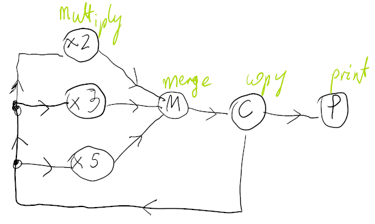

The system generates numbers of the form $2^k \cdot 3^l \cdot 5^m$ in ascending order. It has 4 kinds of threads:
* multiply - multiplies input by number: 2, 3, 5
* merge - sorts the input
* copy - copies the input
* print - prints the input

In the initial state, copy thread has a single input 1. 
